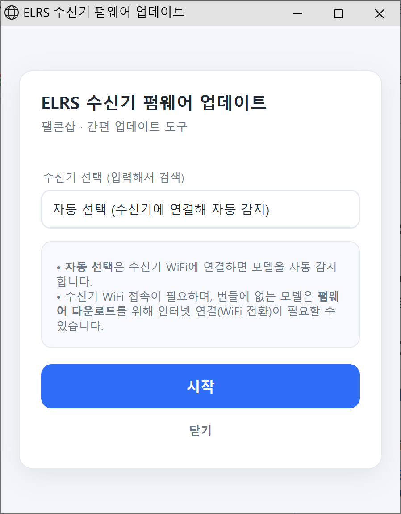
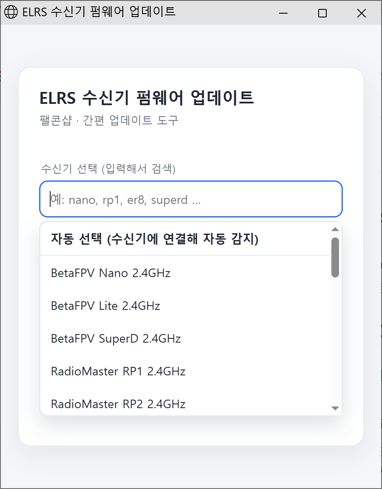
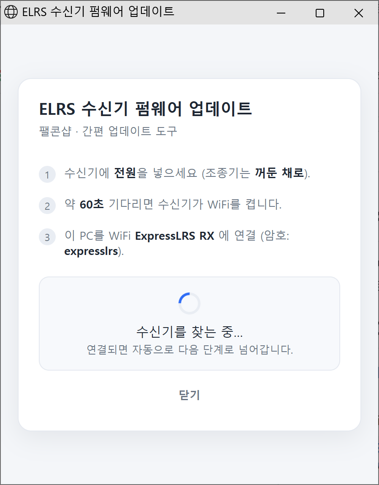
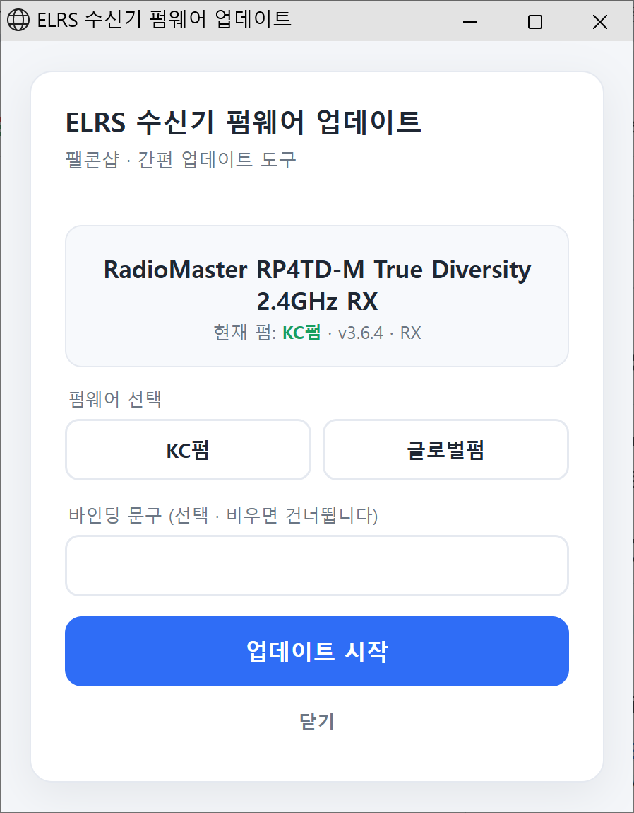
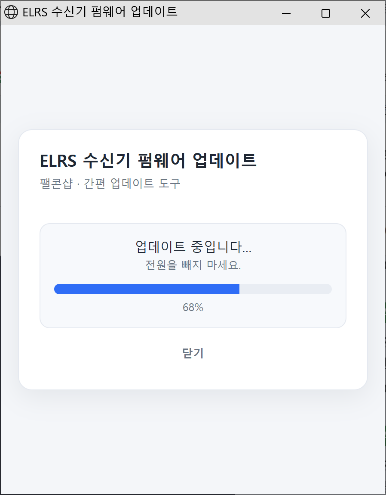
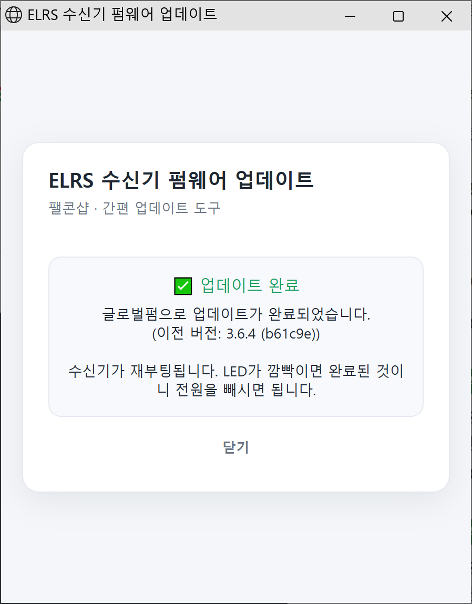
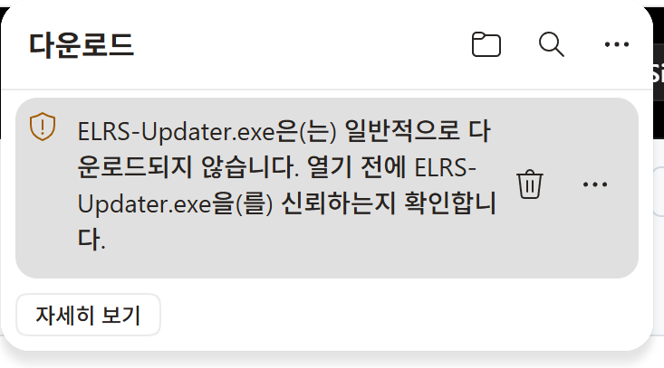

# ELRS 수신기 펌웨어 업데이터 (팰콘샵)

손님이 **선/어댑터/파이썬 없이** ExpressLRS 수신기 펌웨어를 스스로 업데이트할 수 있는 단일 exe 도구.
수신기 내장 WiFi(OTA)를 이용하므로 **베타플라이트·아두파일럿·PX4·FC 없이 서보만** 쓰는 경우 모두 동일하게 동작한다.

## 사용법 (아주 간단)

1. 수신기에 **전원**을 넣는다 (조종기는 **꺼둔 채로**).
2. 약 **60초** 기다리면 수신기가 WiFi를 켠다.
3. PC를 WiFi **`ExpressLRS RX`** 에 연결한다 (암호: `expresslrs`).
4. **[`ELRS-Updater.exe`](https://github.com/falconshop/elrs-updater/releases/latest/download/ELRS-Updater.exe)** 실행 → 창이 뜨고 수신기를 자동 인식 → **업데이트 시작** 클릭.
5. 완료 메시지가 뜰 때까지, 그리고 LED가 다시 깜빡일 때까지 **전원을 빼지 않는다**.

> 폰만 있어도 가능: `ExpressLRS RX` WiFi에 접속 후 브라우저로 `http://10.0.0.1` 접속 → 펌 파일 업로드.
> exe는 이 과정을 자동화하고 올바른 펌을 자동 선택해 줄 뿐이다.

## 화면으로 보는 순서

<table>
<tr>
<td width="50%"><b>1. 수신기 선택</b><br>기본은 <b>자동 선택</b> — 연결된 수신기를 자동 감지합니다.<br><br></td>
<td width="50%"><b>2. 모델 검색·선택</b><br>모델을 알면 <code>nano, rp1, er8</code> 처럼 입력해 고를 수도 있습니다.<br><br></td>
</tr>
<tr>
<td><b>3. 수신기 탐색</b><br>전원 → 약 60초 → WiFi <code>ExpressLRS RX</code> 접속. 연결되면 자동으로 넘어갑니다.<br><br></td>
<td><b>4. 감지 완료</b><br>모델과 현재 펌(KC/글로벌·버전)을 표시. <b>KC펌/글로벌펌</b>을 고르고, 바인딩 문구는 선택 입력합니다.<br><br></td>
</tr>
<tr>
<td><b>5. 업데이트 진행</b><br>진행 중에는 <b>전원을 빼지 마세요</b>.<br><br></td>
<td><b>6. 완료</b><br>수신기가 재부팅됩니다. <b>LED가 다시 깜빡이면</b> 전원을 빼도 됩니다.<br><br></td>
</tr>
</table>

## ⚠️ 다운로드 경고가 떠도 정상입니다 (Windows · Edge)

새로 배포된 프로그램이라 아직 다운로드 이력이 적어, Edge(또는 Windows)에서 아래와 같은
**SmartScreen 안내**가 뜰 수 있습니다. **바이러스가 아니라** "아직 널리 받아지지 않은
파일"이라는 평판 안내일 뿐이며, 그대로 받아 실행하셔도 됩니다.



**Edge에서 받는 법**

1. 다운로드 알림에서 해당 항목 위 `···` → **유지(Keep)**
2. "안전하지 않을 수 있음"이 나오면 → **추가 정보 표시** → **그래도 유지**
3. 실행할 때 파란 "Windows의 PC 보호" 창이 뜨면 → **추가 정보** → **실행**

> Chrome에서는 보통 바로 받아집니다. 혹시 경고가 나와도 마찬가지로 **유지**를 누르시면 됩니다.

이 경고는 프로그램에 **코드 서명 인증서**가 적용되면 사라집니다. (적용 예정)

## 개발자: 펌웨어 넣고 빌드하기

1. 모델별 펌웨어 `.bin`을 `firmware\` 폴더에 넣는다.
   - 이 bin은 ELRS 소스에서 만든 것 (기기선택 프롬프트에서 해당 모델을 구운 최종 `firmware.bin`).
2. `firmware\manifest.json` 에 등록한다:
   ```json
   { "match": "HelloRadio HR8E", "file": "HelloRadio_HR8E.bin", "label": "HelloRadio HR8E 2.4GHz" }
   ```
   - `match`: 수신기의 `GET /target` product_name 에 포함되는 문자열 (대소문자 무시).
   - `file`: `firmware\` 안의 파일명.
3. **`build.bat`** 더블클릭(또는 명령창에서 실행) → `ELRS-Updater.exe` 생성.
4. 여러 모델의 bin을 넣어두면 **연결된 수신기를 자동 감지**해 맞는 펌을 굽는다(통합 exe).

## 동작 원리 (요약)

- `GET  http://10.0.0.1/target` → 연결된 수신기 모델/버전 파악·표시.
- `POST http://10.0.0.1/update` (multipart `data`=bin, 헤더 `X-FileSize`) → 펌 업로드.
- 수신기 펌웨어가 **모델 불일치 bin은 자체 거부**(`status: mismatch`)하므로 오배포로 벽돌 위험이 낮다.

## 개발/테스트

- 실기 테스트(콘솔): `elrs-updater-cli.exe <firmware.bin>` — 실제 수신기를 WiFi로 연결한 상태에서 외부 bin을 굽는다.
- 하드웨어 없이 UI 테스트: `test\mock_rx.py` 로 가짜 수신기를 띄우고
  `set ELRS_HOST=127.0.0.1:8899` `set ELRS_ADDR=127.0.0.1:8080` `set ELRS_NOBROWSER=1` 로 실행 후 브라우저로 확인.

## 환경변수(테스트용)

- `ELRS_HOST` : 수신기 주소 (기본 `10.0.0.1`)
- `ELRS_ADDR` : 로컬 UI 서버 바인드 주소 (기본 랜덤 포트)
- `ELRS_NOBROWSER` : 설정 시 Edge 앱 창을 열지 않고 자동종료도 끔(테스트)

## KC 소스 / 라이선스 (GPLv3)

이 도구(이 저장소의 Go 프로그램)는 **MIT** 라이선스입니다([LICENSE](LICENSE)).
수신기와 WiFi(HTTP OTA)로 **통신만** 하며 ExpressLRS 소스를 포함하지 않는 독립 프로그램입니다.

번들되거나 릴리스에서 내려받는 **펌웨어 바이너리는 ExpressLRS 기반이며 GPLv3**를 따릅니다([NOTICE](NOTICE)).
대응 소스코드는 아래에서 공개되어 있습니다.

- **KC펌 소스** (팰콘샵 KC 포크): https://github.com/falconshop/ExpressLRS-KC/tree/KC-3.6.4
- **글로벌펌 소스**: https://github.com/ExpressLRS/ExpressLRS/tree/3.6.4
- **하드웨어 타겟 정의**: https://github.com/ExpressLRS/targets

KC펌은 공식 ExpressLRS 3.6.4에서 **딱 두 파일만** 다릅니다.

- `src/lib/FHSS/FHSS.cpp` : 2.4GHz FHSS 대역을 ISM(2400.4–2479.4MHz, 80채널)에서
  한국 KC 대역(**2420.4–2479.4MHz, 60채널**)으로 제한 (SX128x + LR1121 2.4 측)
- `src/python/elrs_helpers.py` : 식별용으로 버전 문자열을 `3.6.4-KC`로 표기

전체 변경 내용은 위 KC펌 소스 저장소에서 확인할 수 있습니다.
